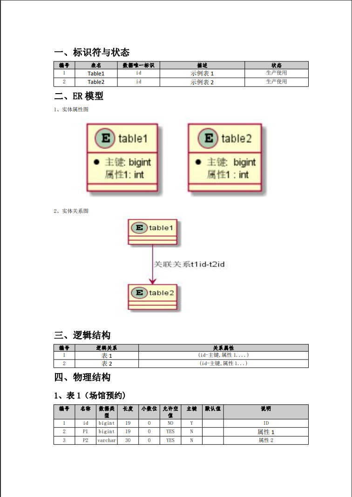

# yutilss 数据库设计文档自动生成
## 简介
 项目开发完成后经常需要数据库设计文档，可以通过工具或代码逆向生成，但是网上的工具通常功能不全，所以自己就码出来一套，现在分享给大家

## 特点
 使用非常简单只需要一行代码即可生成数据库设计文档
- 1. 导出标识符
- 2. 导出er图
- 3. 导出逻辑结构设计
- 4. 导出物理结构设计
- 5. 代码十分简单，只使用了poi与uml，二开十分方便
- 6. 使用栅格设计，使导出的word格式美观
- 7. 等比缩放ER图，设置4个实体一张图片，能将ER图完整清晰的展示在word上，同时ER实体图与关系图分开展示，解决了工具生成ER图拥挤不完整的情况，同时标注了关联关系
- 8. 逻辑设计部分与物理设计部分，由于大小伙伴使用数据库时肯没有写注释，会自动判断，没有注释的展示原始字段


## 使用方式
- 执行命令
`java -jar MainClass.jar prop.txt`  
- prop.txt 参数说明 test 目录下有示例

```
    database=数据库名称
    driver=驱动包（注意MySQL版本区别）
    url=连接地址
    userName=用户名
    passWord=密码
    reportPath=生成文件保存地址
```
## 环境介绍
发行版jar包是以java11 编译的，可以更改源码编译版本。

## 支持的数据库
- mysql 理论上mysql一族的都支持，需要自行更换驱动，默认是mysql8.0

## 支持的文档
- word  使用栅格设计将正文行分为12个栅格，内容按照栅格展示，使页面整齐美观，默认使A4的栅格，可以设置单个栅格的宽度以适应不同纸张大小

